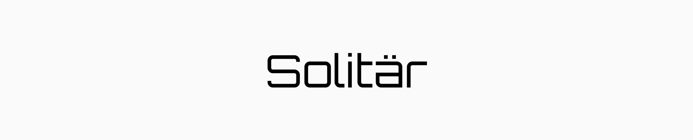

    <picture>
        <source media="(prefers-color-scheme: dark)" srcset=".github/assets/cover-dark.png">
        
    </picture>

    
    
    
    
    
    

---

## Solitar Monorepo

Welcome to the Solitar Monorepo

## License

This project is licensed under [MIT](./LICENSE) license.
